# ☄️ Cometa Champions: Official TCG

¡Bienvenido al repositorio oficial del diseño y estrategia del **Juego de Cartas Coleccionables (TCG)** de Cometa Champions! Este proyecto define la expansión digital y física que llevará el universo de los trompos a un nuevo nivel de coleccionismo y estrategia.

---

## 🌀 El Círculo Cometa (Sistema de Clanes)

El núcleo del juego reside en la interacción entre los 4 grandes clanes. Cada uno posee una identidad única y una ventaja estratégica sobre otro, creando un ecosistema equilibrado de **"Piedra, Papel o Tijera"** avanzado.

> **Mecánica de Ventaja:** Atacar a un clan débil otorga **+1 de Daño (⚔️)** adicional.

*   **Milenarios (🌳)** > Ventaja sobre **Fugitivos (⛓️)**
*   **Fugitivos (⛓️)** > Ventaja sobre **Depredadores (🪓)**
*   **Depredadores (🪓)** > Ventaja sobre **Míticos (🐉)**
*   **Míticos (🐉)** > Ventaja sobre **Milenarios (🌳)**

---

## 🃏 Categorías de Colección (Set Base: 80 Cartas)

La colección inicial se divide en 4 pilares fundamentales, con 20 cartas cada uno (5 por clan):

1.  **Héroes Champions**: Los protagonistas del juego actual en alta fidelidad.
2.  **Bestias Kombat**: Las formas ancestrales y míticas de los personajes. Arte agresivo y stats superiores.
3.  **Trompos Físicos**: El puente entre el juguete real y el mundo digital. Funcionan como objetos y hechizos.
4.  **Arenas / Locaciones**: Escenarios dinámicos que cambian las reglas del campo de batalla.

---

## ✨ Galería de Prototipos (Mockups)

### Campeones Legendarios
Diseños premium con shaders holográficos y acabados metálicos.

| Milenarios | Depredadores | Fugitivos | Míticos |
| :---: | :---: | :---: | :---: |
| 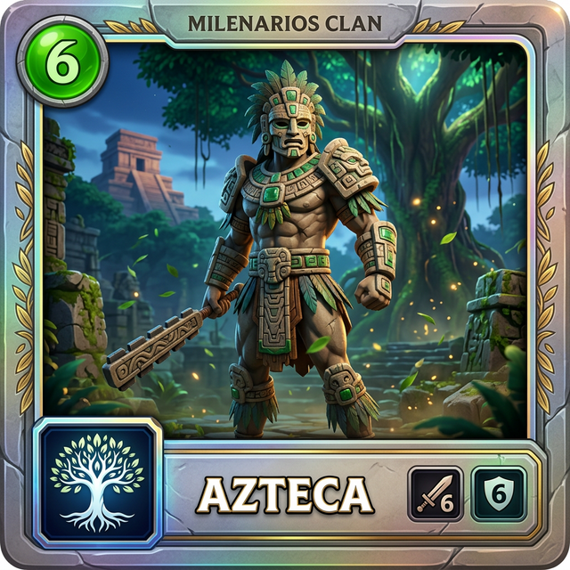 | 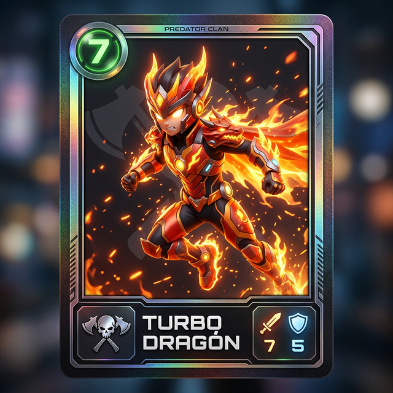 | 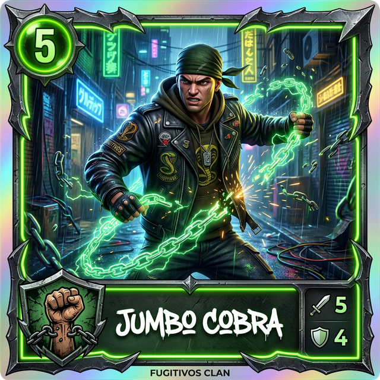 | 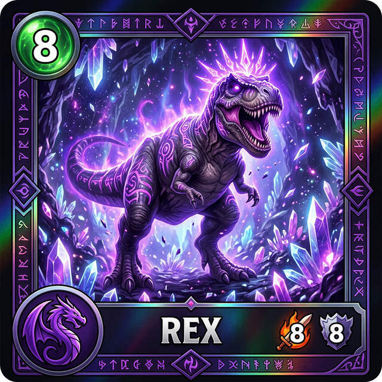 |

### Bestias Kombat (Formas Evolucionadas)
Arte 2D detallado para las cartas más poderosas de la colección.

| Azteca Guardián | Panther Cazadora | Diamante Leviatán | Fénix Ave Ígnea |
| :---: | :---: | :---: | :---: |
| 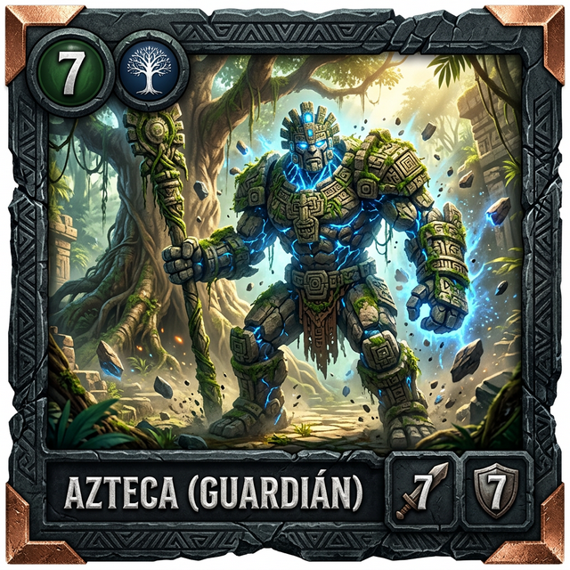 | 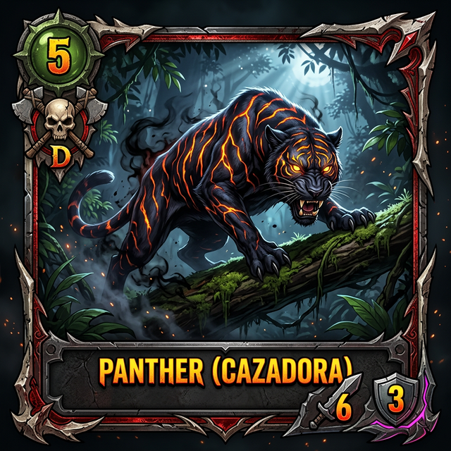 | 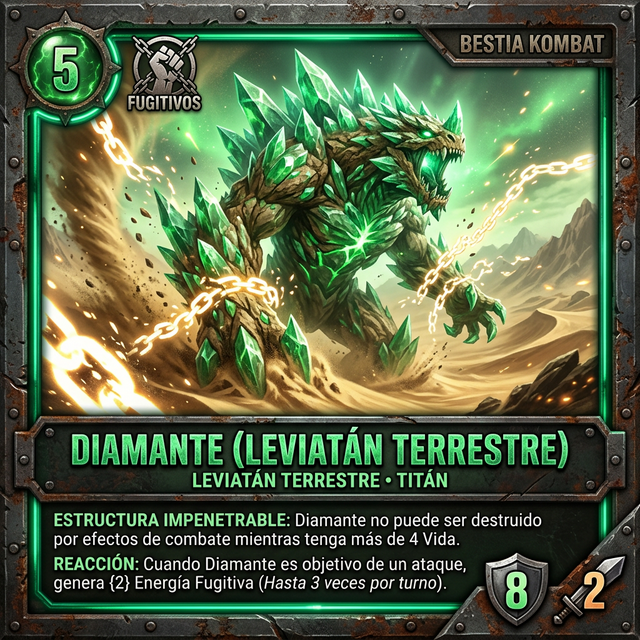 | 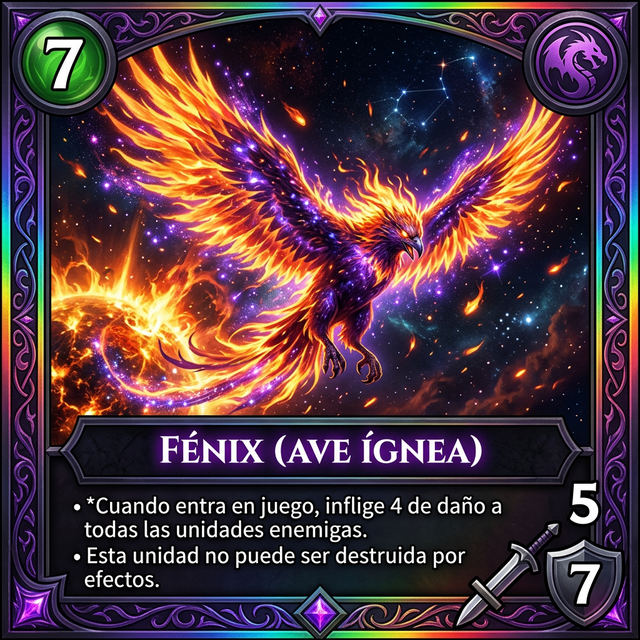 |

### Arenas / Locaciones (Zonas de Batalla)
Panorámicas inmersivas que definen las reglas de combate por clan.

| Templo Milenario | Ruinas de Draconia | Red de la Viuda | Santuario del Sol |
| :---: | :---: | :---: | :---: |
| 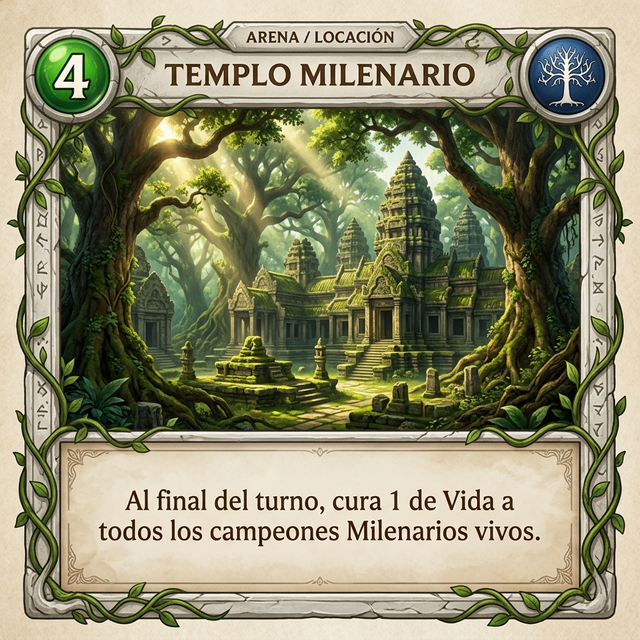 | 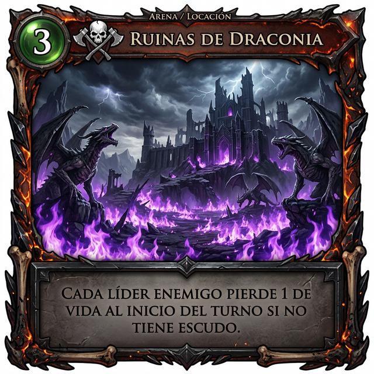 | 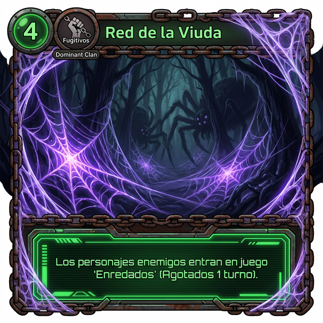 | 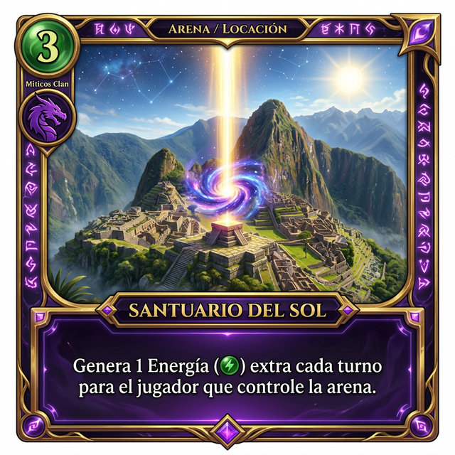 |

### Trompos Físicos (Objetos / Magia)
Renders realistas del producto físico con sus efectos en el juego.

| Trompo Azteca | Trompo King Cobra | Trompo Jumbo Cobra | Trompo Rex |
| :---: | :---: | :---: | :---: |
| 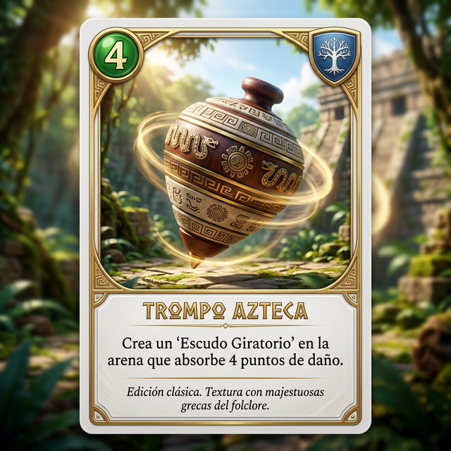 | 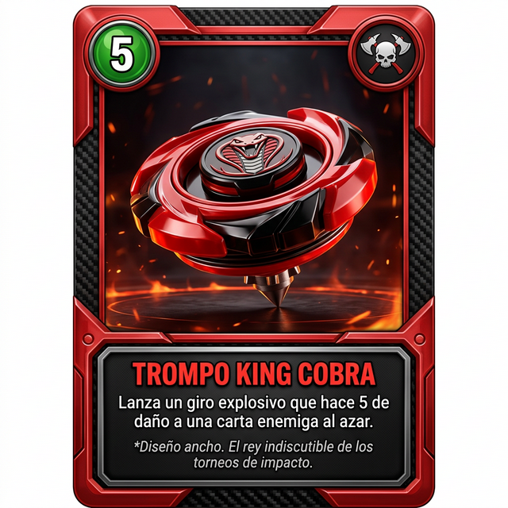 | 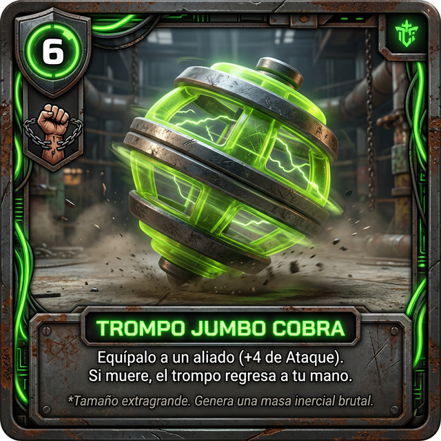 | 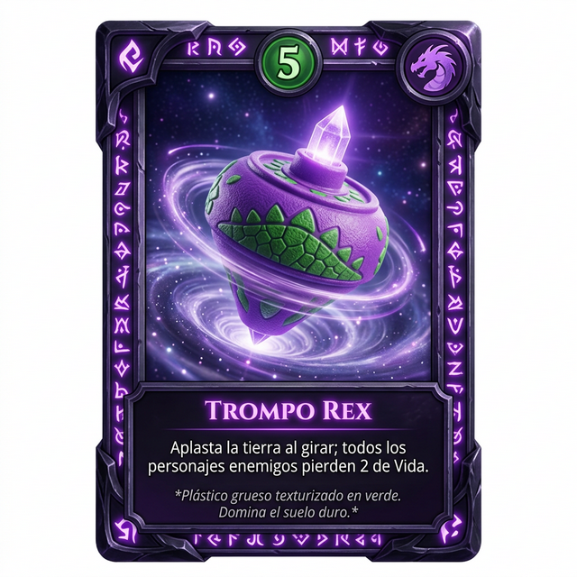 |

---

## 📂 Documentación Técnica

Para una inmersión profunda en las reglas, stats de las 80 cartas y el plan de implementación técnica, consulta:

*   📑 **[Plan de Implementación (Digital & Físico)](./implementation_plan.md)**: Detalle completo de stats, efectos de arenas, sistemas de gacha y reglas de juego 1v1.

---

## 🛠️ Estado del Proyecto
- [x] Diseño de los 4 Clanes y Círculo de Ventajas.
- [x] Listado completo de las 80 cartas del Set Base.
- [x] Auditoría de Balance (Stats vs Costo).
- [x] Prototipado visual de Héroes, Bestias y Arenas.
- [ ] Implementación de UI de Álbum en la App.
- [ ] Producción de Cartas Físicas.

---
*Desarrollado con ❤️ para la comunidad de Cometa Champions.*
