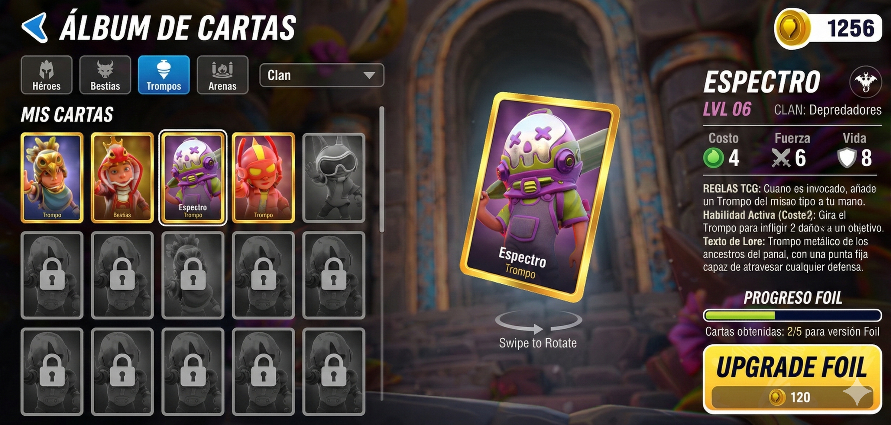

# Plan de Estrategia: Sistema de Cartas Coleccionables (Cometa Champions Mobile)

## Objetivo Principal y Valor Estratégico
Integrar un sistema de álbum o "Gacha" de cartas coleccionables de forma nativa en la próxima actualización de *Cometa Champions Mobile*. El objetivo no es crear un juego de cartas jugable dentro de la app (por ahora), sino una **galería de coleccionismo profunda** que actúe como motor de engagement.

**Beneficios Estratégicos (Retención y Valor Añadido):**
*   **Impulso Masivo al DAU (Usuarios Activos Diarios):** El sistema de sobres, recompensas diarias y la recolección de "Polvo Cometa" para crear cartas faltantes obliga a la creación de una rutina (hábito) en los jugadores, disparando las métricas de retención a 7 y 30 días.
*   **Revalorización del Core Loop (Gameplay):** Jugar el modo historia y competitivo dejará de sentirse vacío a largo plazo. Las partidas ahora son el medio para conseguir sobres y completar páginas del álbum.
*   **Sinergia Físico-Digital (Estrategia Transmedia):** Se educa a la base de miles de jugadores sobre un ecosistema TCG con lore profundo y reglas funcionales de 1v1. Esto construye demanda orgánica ("Hype") para el merchandising físico futuro o la compra de juguetes físicos que incluyan estas mismas cartas.
*   **Alta Percepción de Valor / Bajo Costo Operativo:** Al usar interactividad 3D, Shaders (Normal Maps/Metalness) y efectos de partículas, el jugador percibirá la actualización como masiva y muy "premium" (comprando el arte), pero para el estudio, el costo de programación e integración de UI reciclada es extremadamente bajo en comparación a programar nuevos modos de juego PVE/PVP.

## 1. Estructura de la Colección (Set Inicial 80 Cartas)
El álbum coleccionable inicial estará basado directamente en el documento del TCG, dividido en 4 categorías principales:

1.  **Personajes Cometa Champions (20 Cartas):**
    *   *Visual:* Renders 3D o arte 2D dinámico de los guerreros (ej. Jumbo Cobra, Turbo Dragón).
    *   *Info de Carta:* Estadísticas de "Lore" (Fuerza, Agilidad, Sabiduría según su Clan), historia de fondo, y el nombre de su ataque insignia en el juego.
2.  **Personajes Cometa Kombat (20 Cartas):**
    *   *Visual:* Arte detallado donde los personajes **NO son los niños con trajes**, sino **las criaturas reales / bestias místicas** que representan a los trompos en el universo original.
    *   *Info de Carta:* Estadísticas de "Poder Antiguo" (Ligeramente más fuertes que su contraparte "niño"), descripción de su papel en la guerra original de Kamino/Milenarios/etc., y su conexión con el "Cristal Cometa".
3.  **Trompos Físicos (20 Cartas):**
    *   *Visual:* Fotografía de alta calidad o render hiperrealista del trompo físico de plástico flotando en una arena de *Cometa Champions*.
    *   *Info de Carta:* Datos técnicos del juguete real (ej. Tipo de punta, año de lanzamiento, peso, nivel de rareza física). **[Ancla al producto real]**.
4.  **Arenas / Ambientes (20 Cartas):**
    *   *Visual:* Arte conceptual o capturas panorámicas de los escenarios de *Cometa Champions* y *Cometa Kombat*.
    *   *Info de Carta:* "Lore" del lugar, beneficios o ventajas que ese terreno otorga a clanes específicos en la historia.

## 2. Estrategia de Obtención (Engagement Diario)
Para que los jugadores entren a coleccionar a diario, se implementará un sistema económico y de recompensas (Gacha/Sobres):

### A. Recompensas Diarias (Daily Login)
*   **Día 1-6:** Monedas del juego ("Polvo Cometa" o "Monedas TCG").
*   **Día 7:** Un sobre "Premium" o carta garantizada Rara.
*   *Mecánica de Racha:* Si se rompe la racha de 7 días, el premio gordo se reinicia, forzando la apertura diaria de la app.

### B. Misiones y Actividades (Gameplay Loop)
Se otorgarán sobres de cartas o fragmentos como incentivos directos por jugar el juego principal:
*   **Misiones Diarias:** "Juega 3 partidas en modo Arena" = 1 Sobre Básico.
*   **Misiones Semanales:** "Gana 10 combates usando un guerrero del clan Milenario" = 3 Sobres Épicos.
*   **Logros:** Completar el modo historia o llegar a un rango en el competitivo otorga Cartas Exclusivas que no salen en sobres normales.

### C. Torneos y Eventos (LiveOps)
*   **Sobres Temáticos de Fin de Semana:** Mayor probabilidad de que salgan cartas de 'Trompos Físicos' los viernes y sábados.
*   **Eventos de Jefe Final:** Derrotar a un jefe global o participar en un evento especial de *Cometa Kombat* da cartas holográficas o de edición limitada.

## 3. Experiencia de Usuario (UI/UX) - Flujo y Diseño Visual

Basado en el estilo visual actual del menú principal (entorno 3D hiper-colorido, ruinas/naturaleza, botones amarillos redondeados y texto con bordes claros), esta será la estructura de navegación y el *look & feel*:

### Paso 1: Acceso desde el Menú Principal
Para no saturar la pantalla actual, introduciremos un nuevo punto de entrada estilizado.
*   **Botón "El Álbum" / "Colección":** Se añadirá debajo o al lado de la lista limpia de la izquierda (`Tienda` -> `Equipo` -> `Héroes` -> **`Álbum`**).
*   **Indicador Visual (Notificación):** Si el jugador obtuvo un sobre nuevo en sus partidas, el texto de "Álbum" tendrá un brillo constante o un globo rojo con un número para incitar el clic inmediato.

### Paso 2: La Pantalla del Álbum (El Coleccionador)
Al entrar al álbum, la cámara debe hacer un zoom in dramático sobre "El Cristal Cometa" (o un libro holográfico en el centro de las ruinas) y entrar a la interfaz limpia de la colección.
*   **Fondo Temático:** Mantener el fondo 3D desenfocado del escenario actual (las ruinas y los pinos) para sentir que sigues en el mismo lugar, pero oscurecido para resaltar las cartas.
*   **Navegación por Pestañas Claras:** Arriba aparecerán las 4 categorías como pestañas usando la misma fuente clara con borde azul que se ve actualmente:
    *   [Campeones] | [Historia Kombat] | [Trompos Reales] | [Arenas]
*   **La Cuadrícula de Cartas:** Las cartas se mostrarán en una cuadrícula. Las cartas bloqueadas (no obtenidas) se ven como un cristal vacío gris oscuro, y en el centro un candado con la silueta del personaje.

### Paso 3: La Apertura de Sobres (Unboxing 3D)
Esta es la parte más importante para retener el interés y generar dopamina visual.
1.  **El Tap:** Aparece un "Sobre Holográfico" grande en el centro de la pantalla. Un botón amarillo vibrante (igual al de "INICIAR" actual) dice **ABRIR**.
2.  **La Animación (Teasing):** Al presionar, la cámara tiembla un poco, el sobre se rasga soltando un destello de luz y energía (color amarillo/azul como las estelas de los trompos).
3.  **La Revelación:** Las cartas (de 3 a 5 por sobre) salen volando y caen boca abajo en el centro de las ruinas (el círculo de piedra donde está parado tu personaje en el menú actual).
4.  **Descubrimiento Manual:** El jugador debe "tocar" cada carta boca abajo para voltearla.
5.  **Indicador de Rareza:** Si la carta volteada es Épica o Legendaria, la luz se intensifica, el sonido sube de volumen y la carta tiene un borde iridiscente animado.

### Paso 4: Crafteo y Manejo de Duplicados (Esencia Cometa)
Si al tocar una carta el sistema detecta que ya la tenías, no dice "Repetida" (para evitar decepción visual). En lugar de eso:
*   La carta repetida vibra, hace un sonido eléctrico (como choque de trompos) y estalla en "Polvo/Esencia Cometa" de color violeta.
*   Ese polvo viaja al marcador de monedas arriba a la derecha (junto a tu contador actual de 10,000 monedas). Esa nueva divisa sirve exclusivamente para forjar la carta que te falta.
La interfaz de la galería no debe ser estática, debe sentirse como un logro visual:

*   **Libro Virtual / Galería:** Una pestaña dedicada en el menú principal brillando cuando hay sobres nuevos. Un álbum virtual donde se ven los espacios vacíos con siluetas (incentivando el FOMO - "Fear of Missing Out").
*   **Apertura de Sobres (Unboxing):** Una animación exuberante y satisfactoria al abrir un paquete. Explosión de colores, temblores de cámara al salir una carta "Legendaria", y el sonido emblemático de un trompo girando.
*   **Sistema de Duplicados (Crafteo):** Las cartas repetidas no se pierden. Se convierten en "Esencia Cometa", la cual el jugador puede acumular para *crear* (craftear) específicamente la carta que le falta para completar el álbum.
*   **Efectos Visuales Extra:**
    *   *Cartas Comunes:* Arte normal, material mate.
    *   *Cartas Raras:* Borde plateado básico.
    *   *Cartas Épicas:* Borde dorado, material levemente metálico en el centro.
    *   *Cartas Legendarias:* **Shader Holográfico y Emisivo**. En lugar de requerir arte animado nuevo, se utiliza una textura de arcoíris iridiscente moviéndose (UV Panner) sobre el Normal Map de la carta para simular el plástico holográfico caro de TCGs reales. Se acompaña de un borde brillante (Emissive Material) y un aura de partículas 3D intensas alrededor de la carta en el menú. (Visualmente espectacular y "Premium", pero técnicamente solo es ajustar valores numéricos en un solo material de Unity).

## 4. Retención a Largo Plazo (Metas Finales)
Coleccionar por coleccionar cansa. Se necesitan "Recompensas por Hitos" dentro del juego principal si logran llenar el álbum:

*   **Completar un Sub-Set (ej. Las 20 cartas de Trompos Físicos):** Desbloquea un Skin (Aspecto) o Avatar exclusivo para usar en sus partidas de *Cometa Champions*.
*   **Completar el Tomo 1 (Las 80 cartas base):** Los jugadores reciben una insignia de perfil permanente (ej. "Campeón Coleccionista") e incrementos de experiencia pasiva de +5% permanentemente. 

### Sinergia Física Futura (El Gancho Final)
*   **Escáner QR Integrado:** Si en el futuro se imprimen las cartas físicas reales (como propone el PDF original), la app ya estará lista. Las cartas físicas traerán un QR que el jugador podrá escanear para obtener su versión digital Holográfica instantáneamente en la app, cerrando el ciclo *Físico ➔ Digital*.

## 5. Anexo: Lista de Cartas de Personajes y Estadísticas (Set Base)
Para que el coleccionismo tenga un sentido real de "juego de cartas", cada personaje necesita atributos numéricos. Inspirándonos en TCGs modernos como Lorcana o Hearthstone, usaremos tres estadísticas básicas:
*   🟢 **Costo:** La energía necesaria para jugar la carta.
*   ⚔️ **Fuerza (Ataque):** El daño que hace al rival.
*   🛡️ **Vida (Defensa):** El daño que soporta antes de ser eliminada.

Además, he asignado a cada uno de los 20 campeones su **Clan** correspondiente basándome en su historia (Lore) y las características estéticas de los iconos *(Milenarios=Árbol, Fugitivos=Cadenas rotas, Depredadores=Hachas/Cráneo, Míticos=Dragón/Magia)*.

| Personaje | Clan | 🟢 Costo | ⚔️ Fuerza | 🛡️ Vida | Descripción / Habilidad Resumida | Frase Icónica |
| :--- | :---: | :---: | :---: | :---: | :--- | :--- |
| **Avispón** | Depredadores | 2 | 3 | 1 | Maestro de la velocidad. Reflejos impecables. | *"¡Soy más rápido que el viento!"* |
| **Orión** | Míticos | 4 | 2 | 5 | Sabia y estratégica. Planea antes de atacar. | *"¡Todo está en la estrategia!"* |
| **Jumbo Cobra** | Fugitivos | 5 | 5 | 4 | Ágil y poderoso. Ataca con precisión letal. | *"¡Siempre me levanto más fuerte!"* |
| **Draky** | Fugitivos | 3 | 2 | 4 | Curiosa, supera obstáculos con ingenio. | *"¡La aventura apenas comienza!"* |
| **Azteca** | Milenarios | 6 | 6 | 6 | Fuerte y sabio. Lucha con mucha tradición. | *"¡La historia está de mi lado!"* |
| **Panther** | Depredadores | 4 | 5 | 2 | Sigilosa y letal. Sorprende a sus rivales. | *"¡Silenciosa como una pantera!"* |
| **Silver** | Milenarios | 3 | 3 | 3 | Elegante y brillante. Movimientos estilizados. | *"¡El estilo lo es todo!"* |
| **King Cobra** | Depredadores | 7 | 6 | 7 | Líder natural. Mezcla de gran fuerza y control. | *"¡El rey nunca pierde!"* |
| **Turbo Cobra** | Milenarios | 1 | 2 | 1 | Pura velocidad imparable. | *"¡A toda velocidad!"* |
| **Espectro** | Míticos | 4 | 4 | 3 | Misteriosa. Ataca desde las sombras. | *"¡El misterio es mi fuerza!"* |
| **Tigre** | Depredadores | 5 | 6 | 4 | Valiente y feroz felino. Nunca retrocede. | *"¡Soy una fuerza imparable!"* |
| **Fénix** | Míticos | 6 | 4 | 6 | Cuando cae, se levanta renaciendo. | *"¡El fuego me guía!"* |
| **Rex** | Míticos | 8 | 8 | 8 | Fuerza bruta imparable. Nunca se rinde. | *"¡El poder está en mis manos!"* |
| **Cometín** | Milenarios | 2 | 2 | 2 | Energía inagotable para las aventuras. | *"¡Nunca me detengo!"* |
| **Diamante** | Fugitivos | 4 | 1 | 7 | Resistente como una roca. Defenderá al equipo.| *"¡Fuerte como un diamante!"* |
| **Turbo King** | Fugitivos | 6 | 5 | 5 | Combina la mejor velocidad con pura fuerza. | *"¡El rey del turbo está aquí!"* |
| **Turbo Flash** | Míticos | 3 | 4 | 2 | El más rápido de todos. Rayo de la arena. | *"¡Soy más rápido que un rayo!"* |
| **Spider** | Fugitivos | 3 | 1 | 4 | Astuto, espera en su red el mejor momento. | *"¡La paciencia es clave!"* |
| **Turbo Dragón** | Depredadores | 7 | 7 | 5 | Espíritu ardiente y ataques de alto poder. | *"¡El dragón nunca se rinde!"* |
| **Diamantín** | Milenarios | 1 | 1 | 2 | Pequeña pero valiente y llena de coraje. | *"¡Brillante y fuerte!"* |

## 6. Anexo: Lista de Cartas "Cometa Kombat" (Set Criaturas Antiguas)
A diferencia de Cometa Champions (donde vemos a los **niños** usando trajes inspirados en los trompos), estas 20 cartas muestran a los personajes como **las criaturas míticas y bestias reales** que originaron la leyenda de *Cometa Kombat*. 

Al ser las encarnaciones puras y ancestrales, dentro del TCG estas cartas tienen un costo y estadísticas ligeramente superiores, sintiéndose como las versiones *"Evolucionadas"* o definitivas de la temporada 1. Pertenecen a los mismos clanes.

| Personaje (Forma Bestia) | Clan | 🟢 Costo | ⚔️ Fuerza | 🛡️ Vida | Descripción / Lore Ancestral |
| :--- | :---: | :---: | :---: | :---: | :--- |
| **Avispón (Enjambre)** | Depredadores | 3 | 4 | 2 | La criatura que domina los cielos de la arena a un nivel supersónico. |
| **Orión (Entidad)** | Míticos | 5 | 3 | 6 | Ser cósmico que canaliza pura estrategia ancestral. |
| **Jumbo Cobra (Sierpe)** | Fugitivos | 6 | 6 | 5 | Serpiente colosal capaz de aplastar cualquier obstáculo en su camino. |
| **Draky (Aparecido)** | Fugitivos | 4 | 3 | 5 | Un pequeño dragón que nació directamente de la energía mágica fugitiva. |
| **Azteca (Guardián)** | Milenarios | 7 | 7 | 7 | El gólem de piedra ancestral que defiende los templos de los Milenarios. |
| **Panther (Cazadora)** | Depredadores | 5 | 6 | 3 | La bestia nocturna más temida de las junglas de los Depredadores. |
| **Silver (Metálico)** | Milenarios | 4 | 4 | 4 | Bestia cubierta de plata líquida, deslumbrante y letal. |
| **King Cobra (Rey Bestia)** | Depredadores | 8 | 7 | 8 | La serpiente real primaria, de cuya fuerza nacieron las leyendas. |
| **Turbo Cobra (Víbora)** | Milenarios | 2 | 3 | 1 | Una serpiente pequeña pero capaz de atravesar barreras de sonido. |
| **Espectro (Sombra)** | Míticos | 5 | 5 | 3 | Espíritu puro que caza desde la dimensión oculta de los Míticos. |
| **Tigre (Dientes de Sable)** | Depredadores | 6 | 7 | 5 | El felino prehistórico con garras que destrozan acero. |
| **Fénix (Ave Ígnea)** | Míticos | 7 | 5 | 7 | El pájaro de fuego inmortal de Kamino. |
| **Rex (Tirano)** | Míticos | 9 | 9 | 9 | El dinosaurio rey indiscutible de las tierras místicas, una amenaza divina. |
| **Cometín (Rayo Astral)** | Milenarios | 3 | 3 | 3 | Encarnación pura de una estrella veloz. |
| **Diamante (Leviatán Terrestre)**| Fugitivos | 5 | 2 | 8 | Una criatura de roca cristalizada absolutamente inquebrantable. |
| **Turbo King (Monarca)** | Fugitivos | 7 | 6 | 6 | El líder bestial de las llanuras, imparable si toma velocidad. |
| **Turbo Flash (Relámpago)** | Míticos | 4 | 5 | 2 | Entidad de electricidad pura que corre por los cielos. |
| **Spider (Viuda Escurridiza)** | Fugitivos | 4 | 2 | 5 | Arácnido gigante que teje trampas de cristal cometa. |
| **Turbo Dragón (Wyvern)** | Depredadores | 8 | 8 | 6 | El dragón feroz que reina los cielos de los Depredadores. |
| **Diamantín (Cristalino)** | Milenarios | 2 | 2 | 3 | Pequeño gólem brillante que proyecta escudos defensivos ciegos. |

## 7. Anexo: Lista de Cartas "Trompos Reales" (Set Objetos / Magia)
Esta categoría de 20 cartas es el **puente perfecto entre el juego digital y el juguete físico**. Visualmente, muestran un render hiper-detallado del trompo de plástico sobre un fondo dinámico de *Cometa Champions*.

A diferencia de los Personajes y Bestias que pelean en mesa, estos trompos funcionan bajo las mecánicas de cartas de soporte: **Objetos** o **Hechizos/Equipamiento**. 
*   **No tienen Vida (🛡️) ni Fuerza (⚔️)**, sino **Efectos** sobre los personajes.
*   En el "Sabor" (Lore) de la carta, se incluirán datos reales del producto para fomentar su compra física.

A continuación, la estructura de la tabla con los **20 trompos completada**, alineando los efectos mágicos de las cartas con las estadísticas y lore de los personajes homónimos:

| Trompo Físico (Objeto) | Clan | 🟢 Costo | Tipo de Carta | Efecto en Juego / Habilidad Coleccionable | Sabor de Carta (Datos Reales Sugeridos) |
| :--- | :---: | :---: | :---: | :--- | :--- |
| **Trompo Espectro** | Míticos | 3 | Objeto / Equipamiento | Otorga a un personaje aliado "Invisibilidad" (No puede ser atacado durante 1 turno). | *Punta de metal. Diseño aerodinámico oscuro.* |
| **Trompo Orión** | Míticos | 2 | Objeto / Mejora | Permite al jugador robar 2 cartas extra de su mazo de Invocación. | *Punta giratoria. El clásico ideal para tácticas pensadas.* |
| **Trompo King Cobra** | Depredadores | 5 | Ataque Mágico (Área) | Lanza un giro explosivo que hace 5 de daño a una carta enemiga al azar. | *Diseño ancho. El rey indiscutible de los torneos de impacto.* |
| **Trompo Azteca** | Milenarios | 4 | Defensa Local | Crea un "Escudo Giratorio" en la arena que absorbe 4 puntos de daño. | *Edición clásica. Textura con majestuosas grecas del folclore.* |
| **Trompo Cometín** | Milenarios | 1 | Objeto / Ligero | Un aliado obtiene +1 de Fuerza inmediata en este turno por su empuje. | *Trompo brillante y sumamente ligero. Excelente para empezar.* |
| **Trompo Diamantín** | Milenarios | 2 | Objeto / Curación | Elimina todo el daño que ha sufrido una carta aliada en el campo. | *Plástico translúcido premium. Visualmente deslumbrante.* |
| **Trompo Jumbo Cobra** | Fugitivos | 6 | Objeto / Pesado | Equípalo a un aliado (+4 de Ataque). Si muere, el trompo regresa a tu mano. | *Tamaño extragrande. Genera una masa inercial brutal.* |
| **Trompo Rex** | Míticos | 5 | Hechizo Sísmico | Aplasta la tierra al girar; todos los personajes enemigos pierden 2 de Vida. | *Plástico grueso texturizado en verde. Domina el suelo duro.* |
| **Trompo Avispón** | Depredadores | 2 | Hechizo / Velocidad | Permite que un personaje que acaba de entrar ataque inmediatamente este turno. | *Textura rayada. Corta el viento con un zumbido agudo.* |
| **Trompo Draky** | Fugitivos | 3 | Hechizo / Astucia | Obliga al oponente a mostrar su mano y descartar la carta de menor costo. | *Compacto y travieso. Rebota de formas impredecibles.* |
| **Trompo Panther** | Depredadores | 4 | Objeto / Emboscada | Puedes jugar este trompo en el turno del rival para bloquear su ataque directamente. | *Color negro mate. Diseñado para atacar sin ser visto.* |
| **Trompo Silver** | Milenarios | 3 | Objeto / Escudo | Refleja el próximo daño mágico que reciba tu héroe hacia el enemigo. | *Pintura metalizada especial que destella con el sol.* |
| **Trompo Turbo Cobra** | Milenarios | 1 | Objeto / Descarte | Roba 1 carta y descarta 1 carta para ciclar tu mazo rápidamente. | *Diseño hiper-estilizado para minimizar la fricción en la pista.* |
| **Trompo Tigre** | Depredadores | 5 | Objeto / Equipamiento | Equípalo a un aliado para ganar *Golpe Penetrante* (Ignora escudos enemigos). | *Con patrones atigrados naranjas. Un depredador nato de plástico.* |
| **Trompo Fénix** | Míticos | 6 | Hechizo / Resurrección | Elige un personaje aliado derrotado de tu cementerio y devuélvelo a tu mano. | *Tonos cálidos rojizos. Promete levantar a cualquier jugador caído.* |
| **Trompo Diamante** | Fugitivos | 4 | Objeto / Fortificación | Da a todos tus personajes **Fugitivos** +2 de Vida máxima permanente. | *Translúcido cristalino, prácticamente inquebrantable a caídas.* |
| **Trompo Turbo King** | Fugitivos | 6 | Ataque Mágico (Poder) | Haz daño igual a la suma del costo de tus personajes **Fugitivos** en el campo. | *Coronado con detalles dorados. Hecho para verdaderos líderes.* |
| **Trompo Turbo Flash** | Míticos | 3 | Hechizo / Reubicación | Devuelve un personaje enemigo con costo 3 o menor a la mano de su dueño. | *Pintura ultrabrillante. Desaparece tan rápido como entra al ring.* |
| **Trompo Spider** | Fugitivos | 3 | Objeto / Trampa | Juega boca abajo. El primer enemigo que ataque este turno queda "Enredado" (no ataca). | *Diseño con telarañas grabadas en el cuerpo para un agarre mortal.* |
| **Trompo Turbo Dragón** | Depredadores | 7 | Hechizo / Cataclismo | Destruye todas las cartas de "Arena/Locación" activas y hace 3 de daño al líder. | *Edición especial. Las "escamas" laterales desgarran el aire al girar.* |

*Nota Estratégica: Al leer el Efecto e interactuar con la carta, el jugador asociará la fuerza de la habilidad del cartón digital, con su contraparte de juguete físico; generando demanda orgánica para merchandising real.*

## 8. Anexo: Lista de Cartas "Locaciones / Arenas" (Set Campos de Batalla)
Para completar las 80 cartas exactas del Set Base, necesitamos los **20 escenarios**. Como muestra el documento original del TCG, las Locaciones cambian las reglas del juego mientras están activas. 

He dividido las 20 locaciones equitativamente: 5 Arenas/Territorios para cada uno de los 4 Clanes. Cada carta tiene un Efecto Pasivo que dura mientras la arena esté "en juego".

| Nombre de la Locación | Clan Dominante | 🟢 Costo | Efecto de Arena (Modificador de Reglas) | Descripción Visual / Lore |
| :--- | :---: | :---: | :--- | :--- |
| **Templo Milenario** | Milenarios | 4 | Al final del turno, cura 1 de Vida a todos los campeones Milenarios vivos. | Antiguo altar de piedra rodeado de robles gigantescos. |
| **Ruinas de Draconia** | Depredadores | 3 | Cada líder enemigo pierde 1 de Vida al inicio del turno si no tiene escudo. | Castillo destruido con dragones de piedra y fuego morado. |
| **Valle de Pruebas** | Milenarios | 2 | Los personajes de Costo 3 o menos ganan +1 de Vida máxima. | Círculo de combate ancestral de los Milenarios. |
| **Nido del Wyvern** | Depredadores | 5 | Los ataques de los personajes Depredadores no pueden ser contraatacados. | Cima montañosa llena de huevos de criaturas agresivas. |
| **Ciudadela Plateada** | Milenarios | 4 | Todo el daño Mágico que entra a la ciudadela se reduce en 2. | Fortaleza mística forjada completamente en Plata líquida. |
| **Santuario del Sol** | Míticos | 3 | Genera 1 Energía (🟢) extra cada turno para el jugador que controle la arena. | Ruinas Mayas iluminadas perennemente por un rayo de sol. |
| **Red de la Viuda** | Fugitivos | 4 | Los personajes enemigos entran en juego "Enredados" (Agotados 1 turno). | Un bosque oscuro y denso, plagado de telas de araña mágicas. |
| **Llanuras del Tirano** | Míticos | 6 | Aumenta el Ataque base de todos los personajes en el campo en +2. | Tierra árida donde alguna vez reinó Rex. Promueve la violencia bruta. |
| **Caídas de Kamino** | Fugitivos | 3 | Una vez por turno, puedes mandar tu propia carta al Cementerio para robar otra. | Cataratas místicas que funcionan como portales interdimensionales. |
| **Cimientos de Cristal** | Míticos | 5 | El primer personaje aliado que jugues cada turno cuesta 1 menos de Energía. | Caverna subterránea brillante, origen del Cristal Cometa. |
| **Arenas Movedizas** | Fugitivos | 2 | Al final del turno, empuja a un campeón enemigo de vuelta a la mano de su dueño. | El desierto impenetrable que rodea los reinos de los Fugitivos. |
| **Volcán Sangriento** | Depredadores | 6 | Inflige daño igual a la Fuerza de tu campo de batalla a un solo objetivo. | Caldera activa lista para estallar; el hogar de los clanes letales. |
| **Torreón de Espectro** | Míticos | 4 | Mientras esté activa, tu mano de Invocación está oculta para los efectos rivales. | Biblioteca infinita que flota entre realidades sombrías. |
| **Laboratorio del Rey** | Fugitivos | 4 | Permite buscar y añadir una carta "Trompo Físico" directamente de tu mazo. | Guarida científica llena de piezas de trompos y energía errática. |
| **La Pista de Carreras**| Milenarios | 2 | Todos los campeones con la palabra "Turbo" ganan +2 de Ataque Inmediato. | Desfiladero de piedra modificado para correr a velocidad sónica. |
| **Pozo de los Depredadores**| Depredadores | 3 | El jugador con menos Vida sacrifica un campeón para ganar poder. | Arena de combate clandestina en las cloacas de la ciudad. |
| **Cementerio de Juguetes** | Milenarios | 5 | Invoca un "Espíritu Cometa" de Vida 1/Ataque 1 cada vez que un aliado muera. | Un valle lleno de trompos antiguos, oxidados y olvidados, herencia de los Milenarios. |
| **Campamento Panther** | Depredadores | 3 | Tus emboscadas no tienen costo de energía la primera vez. | Asentamiento nómada escondido en la penumbra del bosque. |
| **Bóveda del Cometa** | Fugitivos | 6 | Ningún jugador puede modificar sus Puntos de Vida Base. | Fortaleza de máxima seguridad donde se esconde el polvo mágico. |
| **La Arena Campeones** | Neutral | 7 | (Carta Épica) Todos los personajes recuperan la vida completa al entrar. | El coliseo brillante y definitivo donde convergen los 4 clanes. |

---

## Resumen del Álbum Final (El Tomo 1)
Con estos escenarios, hemos completado las **80 piezas coleccionables** que estructuran el primer gran "Tomo" de actualización para la aplicación *Cometa Champions Mobile*:

| Categoría en la App | Propósito y Sabor de la Colección |
| :--- | :--- |
| **Héroes Champions (20)** | Los jóvenes de la era actual (renders 3D del juego), muestran los Stats base de personajes equilibrados. |
| **Bestias Kombat (20)** | Homenaje a la encarnación mítica original. Stats elevados como versiones 'Evolucionadas' o premium. |
| **Trompos Físicos (20)** | Hechizos, Equipamientos y Trucos mágicos basados en el lore físico del juguete. |
| **Locaciones / Arenas (20)** | Campos de batalla que alteran las reglas del tablero y benefician a ciertos Clanes. |
| **TOTAL** | **80 Cartas Iniciales ("Tomo 1")** |

---

## 9. ¿Qué falta para una Experiencia Coleccionable Satisfactoria? (Sin Complejidad)
Dado que el objetivo es mantener el desarrollo **lo más simple posible** (sin necesidad de programar un motor de combate PVE/PVP complejo), el peso del "engagement" recae 100% en que la acción de coleccionar sea **altamente placentera y genere hábito**. Para lograr esto, necesitamos enfocarnos en el "Jugo" (Game Feel):

### A. El Sistema de Progresión Visual (Materiales 3D y Partículas)
El problema de un álbum estático es que sacar "cartas repetidas" frustra al jugador. La solución técnica más eficiente y visualmente espectacular es la **Evolución Visual 3D**:
*   **El Modelo 3D (El Cartón Digital):** En lugar de imágenes 2D Planas, la carta será un plano 3D de doble cara. La parte trasera Siempre tendrá el logo y diseño oficial del TCG. La parte delantera cambiará dinámicamente según la carta que estemos viendo.
*   **Interacción de Rotación 3D:** ¡Crucial para el "Game Feel"! Al igual que los personajes en el menú principal, el jugador podrá **rotar la carta libremente sobre su eje vertical (Y)** deslizando el dedo, permitiéndole ver ambos lados y apreciar cómo la luz del menú interactúa con los materiales metálicos de la rareza actual.
*   **Sistema de Partículas Escalonado:** Al abrir una carta repetida, esta gana nivel. Mientras más nivel o rareza tenga la carta, el sistema de partículas acoplado a ella se vuelve más espectacular (aumentando la cantidad, el brillo y el color de las chispas/estelas que la rodean).
*   **Materiales Dinámicos (Normal Maps & Metallic):** No necesitamos dibujar artes nuevos para las cartas especiales. Usaremos el *Normal Map* del diseño base de la carta y, mediante el uso de materiales (Shaders), modificaremos dinámicamente los valores de *Brillo* y *Metálico (Metallic)*.
    *   *Nivel 1:* Material de cartón/mate estándar.
    *   *Nivel 2:* Material con brillo, similar a un plastificado (Foil).
    *   *Nivel 3:* Modificación del valor metálico para que la carta entera parezca forjada en **Oro puro**.
*   *Beneficio:* Esto es facilísimo de integrar a nivel de programación en Unity/Unreal cambiando parámetros de un Material, pero para el niño, conseguir la "versión de Oro" de su personaje favorito será un incentivo masivo para jugar diario.

### B. Misiones de Coleccionista Simples (El Hábito Diario)
No necesitamos crear modos nuevos, solo atar recompensas de sobres a lo que la gente ya hace en el juego:
*   **"Juega 1 partida hoy"** = 1 sobre clásico.
*   **"Gana 5 partidas en la semana"** = 1 sobre de "Trompos Reales".
*   *Mecánica de Álbum:* Añadir un botón simple de "Reclamar Recompensa" dentro de la pantalla del álbum cuando hayan completado, por ejemplo, toda la página de los Míticos. La recompensa puede ser algo reciclado (Diamantes o un Avatar).

### C. Experiencia Sensorial (Audio y FX)
El acto de presionar un botón no enriquece. El "Unboxing" lo es todo.
*   **Audio Reactivo:** Al entrar al álbum, la música debe cambiar a algo más épico o misterioso. 
*   Al abrir un paquete, la cámara vibra, hay una explosión amarilla y mucho ruido tipo "Gacha-game" japonés.
*   Al tocar la carta física de "Diamantín", debe escucharse el sonido característico del plástico golpeando el suelo.

Siguiendo estrictamente esta línea, la actualización requerirá un esfuerzo de programación mínimo (solo una interfaz de galería + un sistema de RNG (Random Number Generator) para soltar las cartas), pero visual y auditivamente se sentirá como una expansión gigantesca que dará un "valor adicional" masivo a *Cometa Champions*.

---

## 10. Referencia Visual (Layout UI) para el Diseñador Gráfico
Para facilitar la labor del equipo de arte y UI, aquí presentamos los mockups conceptuales que dictan cómo debe estructurarse el "Marco" (Frame) de cada una de las 4 categorías principales para mantener coherencia en el TCG coleccionable.

### 1. Carta "Héroe Champion" (Niño 3D)
*   **Layout:** Limpio y moderno. 
*   **Zona Superior:** Costo de Energía (🟢) arriba a la izquierda.
*   **Zona Central:** El Render 3D del niño. Fondo con patrón abstracto del Clan.
*   **Zona Inferior (Pie de carta):** Nombre del personaje, ícono de Espada con valor de Ataque (⚔️) e ícono de Escudo con valor de Vida (🛡️).
*   **Indicador de Ventaja (Visual Tip):** El ícono del Clan debe incluir una pequeña flecha o borde de color que apunte simbólicamente al clan sobre el cual tiene ventaja, facilitando el aprendizaje del "Círculo Cometa". (Ej: El árbol Milenario tiene una pequeña raíz que envuelve una cadena).

#### Galería de Referencia (Héroes Legendarios):

### 2. Carta "Bestia Kombat" (Criatura Evolucionada)
*   **Layout:** Agresivo, oscuro, "Destruido". Indica rareza premium.
*   **Zona Superior:** Costo de Energía (🟢) y el **Ícono del Clan** (cada bestia pertenece al clan de su invocador).
*   **Zona Central:** Arte 2D hiperdetallado de la bestia/criatura original.
*   **Zona Inferior (Pie de carta):** Mismas estadísticas que los Héroes (Ataque ⚔️ y Vida 🛡️), pero con un panel de nombre más oscuro e imponente.

#### Galería de Referencia (Bestias Kombat):

### Arenas / Locaciones (Zonas de Batalla)
Panorámicas inmersivas que definen las reglas de combate por clan.

| Templo Milenario | Ruinas de Draconia | Red de la Viuda | Santuario del Sol |
| :---: | :---: | :---: | :---: |
|  |  |  |  |

### 3. Carta "Trompo Físico" (Objeto Mágico)
*   **Layout:** Vertical, enfocado en mostrar el producto real y su habilidad mágica. **No tiene stats de combate**.
*   **Zona Superior:** Costo de Energía (🟢) y el **Ícono del Clan** (el trompo pertenece al clan que lo fabrica).
*   **Zona Central/Superior:** El render fotográfico del trompo físico flotando.
*   **Zona Inferior:** Un recuadro grande de texto que explica el efecto de la carta en el juego y un texto de "Sabor/Lore" describiendo los materiales reales de venta del trompo.
*   **Zona Inferior:** Un recuadro grande de texto que explica el efecto de la carta en el juego y un texto de "Sabor/Lore" describiendo los materiales reales de venta del trompo.

#### Galería de Referencia (Trompos Físicos):

### 4. Carta "Locación / Arena" (Modificador de Terreno)
*   **Layout:** Enfocado panorámicamente en el paisaje.
*   **Zona Superior:** Costo de Energía (🟢) y el **Ícono del Clan Dominante** (para indicar a quién beneficia la arena).
*   **Zona Central:** Ilustración apaisada de la zona o campo de batalla.
*   **Zona Inferior:** Como los objetos, no tiene stats de personaje. El tercio inferior es un pergamino o caja de texto que detalla el "Efecto Pasivo" de la Arena. El marco debe representar los materiales del Clan (ej. piedra de templo para Milenarios).
*   **Zona Inferior:** Como los objetos, no tiene stats de personaje. El tercio inferior es un pergamino o caja de texto que detalla el "Efecto Pasivo" de la Arena. El marco debe representar los materiales del Clan (ej. piedra de templo para Milenarios).

#### Galería de Referencia (Arenas / Locaciones):

---

## 11. Pantalla Principal del "Álbum" (Adaptación de la Interfaz Existente)
Para maximizar la eficiencia y mantener una experiencia de usuario (UX) consistente con *Cometa Champions*, el Menú Principal del Álbum de Cartas **reciclará la estructura de la actual "Pantalla de Selección de Personajes"**.

Instrucciones para el Diseñador Gráfico / UI:

*   **Panel Izquierdo (Cuadrícula Constante):** 
    *   Al igual que la lista de héroes, aquí habrá un *Scroll Vertical* con las miniaturas de las 80 cartas.
    *   **Cartas Bloqueadas:** Se mostrarán ensombrecidas (grises) con un ícono de candado, igual que los personajes bloqueados actuales (ej. Silver).
    *   **Cartas Desbloqueadas:** Mostrarán la miniatura del arte y un indicador visual de su nivel de progresión (ej. Marco dorado brillante para Nivel 2 o Foil).
    *   **Filtros (Opcional):** Botones pequeños arriba de la cuadrícula para filtrar por "Tipo" (Héroes, Bestias, Trompos, Arenas) o por "Clan".

*   **Área Central/Izquierda-Media (El Viewport 3D):**
    *   Donde actualmente se renderiza el modelo del personaje (ej. Espectro 3D), **aquí flotará el Modelo 3D de la Carta seleccionada**.
    *   *Interacción:* El jugador debe poder deslizar el dedo (Swipe) horizontalmente sobre esta zona para **rotar la carta libremente en su eje vertical (Y)**, permitiendo inspeccionar la parte trasera (Logo Cometa) y ver cómo el shader metálico interactúa con la luz frontal en tiempo real.

*   **Panel Derecho (Información y Stats):**
    *   **Encabezado:** Nombre de la carta en grande y el ícono de su Clan (ej. Símbolo del dragón para Depredadores). Debajo del clan, mostrar texto dinámico: **"Ventaja contra: [Nombre del Clan]"** para educar al jugador.
    *   **Barras de Estadísticas:** Reemplazar las barras actuales (*Health, Damage*, etc.) por los valores fijos de TCG:  **Costo (🟢)**, **Fuerza (⚔️)** y **Vida (🛡️)** (para Trompos y Arenas, estas barras se ocultan).
    *   **Caja de Texto (Lore/Habilidad):** El texto descriptivo que explica la habilidad del trompo o la breve historia ancestral de la criatura.
    *   **Botón Inferior (Progreso):** En lugar del botón "Upgrade", aquí habrá un medidor de progresión: *"Cartas obtenidas: 2/5 para versión Foil"*.

---

## 12. Esquema de Reglas de Juego (Juego Físico TCG - "Cometa Champions")
Si bien la versión inicial dentro de la app móvil es estrictamente de coleccionismo, hemos diseñado los atributos de las cartas (Costo, Fuerza, Vida, Habilidad) para que el juego sea matemático y legalmente jugable en el mundo real (físico). 

Aquí detallo cómo fluiría una partida física de *Cometa Champions TCG* basada en esta estructura, lista para cuando se impriman los cartones.

### El Ciclo de Ventajas (El Círculo Cometa)
Para añadir profundidad táctica, los clanes siguen un sistema de ventajas circular. Un personaje tiene ventaja ofensiva sobre otro si pertenece al clan superior en el círculo:

*   **Milenarios** (🌳) tienen ventaja sobre **Fugitivos** (⛓️).
*   **Fugitivos** (⛓️) tienen ventaja sobre **Depredadores** (🪓).
*   **Depredadores** (🪓) tienen ventaja sobre **Míticos** (🐉).
*   **Míticos** (🐉) tienen ventaja sobre **Milenarios** (🌳).

**Mecánica de Ventaja:** 
Cuando un personaje ataca a un objetivo sobre el cual tiene ventaja de clan, inflige **+1 de Daño (⚔️)** adicional. Esta bonificación se aplica antes de calcular cualquier otro modificador o escudo.

### Conceptos Básicos
*   **Objetivo del Juego:** Reducir los Puntos de Vida (HP) del jugador rival de 20 a 0.
*   **El Mazo (Deck):** Cada jugador debe armar un mazo de exactamente **30 cartas**. Se permiten hasta 3 copias de una misma carta (ej. puedes tener 3 "Spiders").
*   **Zona de Juego (El Tapete):**
    *   *Mazo y Cementerio:* Donde robas y donde van las cartas destruidas o usadas.
    *   *Zona de Campeones (Frente):* Donde colocas tus personajes y bestias.
    *   *Zona de Energía (Atrás):* Donde colocas cartas boca abajo para usarlas como recursos (🟢).
    *   *Zona de Arena (Lateral):* Donde se coloca la Locación actual.

### Sistema de Costo y "Cristales de Energía" (🟢)
Para bajar una carta a la mesa, debes pagar su Costo 🟢. ¿De dónde sale la energía?
*   Una vez por turno, en tu fase de preparación, puedes agarrar **cualquier carta de tu mano y ponerla boca abajo en tu Zona de Energía**.
*   Cada carta boca abajo funciona como "1 Cristal Cometa" que se recarga cada turno. (Si pones una carta cada turno, en el turno 4 tendrás 4 de energía para bajar cartas de costo 4).

### Las 3 Fases del Turno
Inspirado en los TCG modernos para lograr batallas limpias, cada turno sigue este orden:

>**Fase 1: Preparación (Robo y Recarga)**
>*   Robas 1 carta del tope de tu mazo al inicio de tu turno.
>*   Enderezas todas tus cartas de personaje (que se agotaron/giraron el turno anterior) y recargas tus cartas de energía boca abajo.
>*   (*Opcional*) Puedes poner 1 carta de tu mano boca abajo como Nueva Energía.

>**Fase 2: Acción (Despliegue y Combate)**
>En esta fase puedes hacer varias cosas en el orden que gustes, siempre que tengas energía:
>*   **Jugar Campeones/Bestias:** Pagas su Costo 🟢 agotando (girando) tus cartas de energía, y colocas el personaje en el campo. Los personajes nuevos entran con mareo (no pueden atacar este turno).
>*   **Jugar Trompos Físicos (Cartas Mágicas):** Pagas la energía, aplicas su texto de efecto directamente (apoyar a tu equipo o dañar al rival), y luego la manda al cementerio.
>*   **Jugar Locaciones/Arenas:** Pagas su costo y la pones en el campo. Reemplaza a cualquier arena anterior (solo hay 1 arena activa en todo el juego). Su efecto se aplica inmediatamente.
>*   **¡Combate!:** Eliges a uno de tus personajes que ya no tenga mareo, lo *Giras* (lo agotas), y declaras a quién ataca.

>**Fase 3: Finalización**
>*   Resuelves efectos de "Al final del turno" y le pasas el turno a tu oponente.

### Mecánicas de Combate (Fuerza ⚔️ vs Vida 🛡️)
*   Cuando declaras un ataque, eliges si golpeas a un **Personaje Rival (girado)** o directo a los **Puntos de Vida del Jugador Oponente**.
*   Solo puedes atacar a un campeón enemigo si este está *girado / agotado* (es decir, lo atacas mientras está expuesto después de haber hecho una acción; como en juego reales, si te defiendes no puedes atacar).
*   **El Choque:** Si combaten dos cartas (ej. Avispón de Fuerza 3 / Vida 1 contra Diamantín Fuerza 1 / Vida 2):
    *   **Cálculo de Ventaja:** Si el atacante tiene ventaja de clan, suma +1 a su Fuerza. 
    *   En el ejemplo: Si Avispón (Depredador) ataca a un Mítico, su Fuerza sube de 3 a 4 para ese ataque.
    *   Ambas cartas se hacen daño al mismo tiempo: El daño recibido se resta de la Vida actual.
    *   Una carta con Vida 0 o menor va al cementerio.
*   *Nota de Daño Permanente:* A diferencia de otros juegos, el daño en *Cometa Champions* se queda en la carta entre turnos. Si un personaje sobrevive con 1 de Vida, el oponente lo puede rematar después con una carta de Trompo Físico que haga poco daño.

*Con estas reglas y los valores (Stats) especificados en los anexos, la colección digital no solo sirve como galería de arte, sino que conforma un motor lógico balanceado listo para producción de juguetes.*

---

## 13. Ficha Técnica de Dimensiones y Formatos

Para asegurar la compatibilidad entre la aplicación digital y la futura producción física, se han definido las siguientes especificaciones técnicas basadas en el estándar **Standard TCG** (utilizado por juegos como *Disney Lorcana* y *Magic: The Gathering*).

### A. Especificaciones para Impresión (Físico)
*   **Tamaño Final (Corte):** 63.5 mm x 88.9 mm (2.5" x 3.5").
*   **Tamaño con Sangría (Bleed):** 69.5 mm x 94.9 mm (Se recomiendan 3 mm de margen adicional por cada lado para evitar bordes blancos al cortar).
*   **Radio de Esquina:** 3.5 mm.
*   **Grosor Sugerido:** 0.30 mm a 0.35 mm (300gsm a 350gsm).

### B. Especificaciones Digitales (App Mobile)
*   **Relación de Aspecto:** 1 : 1.4 (Ancho : Alto).
*   **Resolución Estándar:** 750 x 1050 px (Equivalente a 300 DPI - Ideal para fluidez en dispositivos gama media).
*   **Resolución Premium / Retina:** 1500 x 2100 px (Equivalente a 600 DPI - Recomendado para visualización de "Cartas Legendarias" con zoom).
*   **Formato de Archivo:** 
    *   *UI de la App:* PNG o WebP con transparencia (si el marco es irregular).
    *   *Texturas del álbum:* Atlas de texturas comprimidos para optimizar memoria RAM.

### C. Guía de Diseño (Safe Zone)
Para evitar que elementos importantes (costo, stats) queden muy cerca del borde físico o sean tapados por marcos de la UI en el móvil:
*   **Margen de Seguridad:** Mantener todo el texto e íconos críticos al menos a **5 mm** del borde final de la carta.
